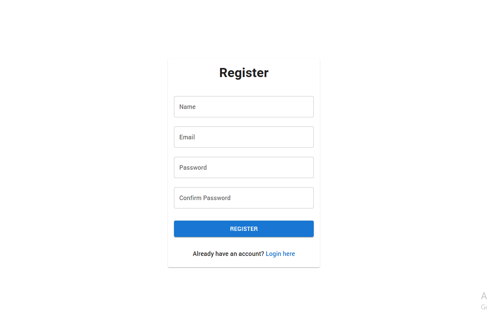
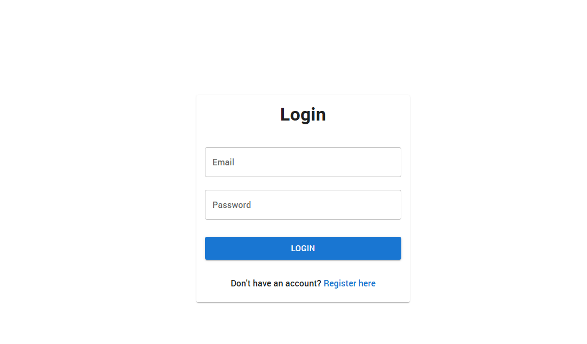
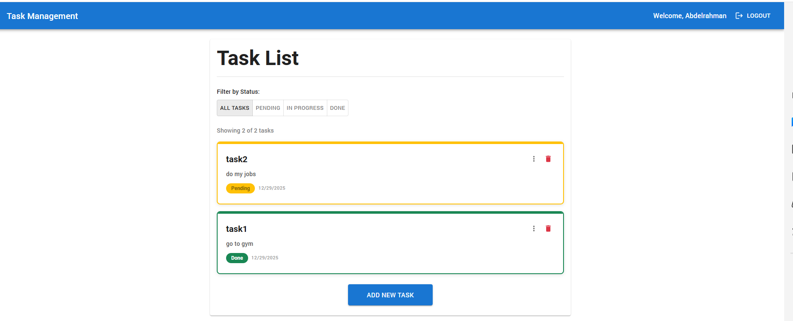

# website screenshots





# Task Management Application

A full-stack Task Management Application built with React (Frontend) and Node.js/Express (Backend), featuring user authentication, task CRUD operations, and role-based access control.

## 🎯 Features

### Authentication

- ✅ User Registration with email and password
- ✅ User Login with JWT token-based authentication
- ✅ Persistent authentication (token stored in localStorage)
- ✅ Token refresh mechanism with rotation
- ✅ Secure logout functionality
- ✅ Protected routes (auto-redirect to login if not authenticated)

### Task Management

- ✅ Create tasks with title and description
- ✅ View all user tasks
- ✅ Update task details and status
- ✅ Delete tasks with confirmation
- ✅ Filter tasks by status (Pending, In Progress, Done)
- ✅ Real-time task count display
- ✅ Task timestamps (created date)

### UI/UX Features

- ✅ Modern Material-UI components design
- ✅ Responsive design (mobile, tablet, desktop)
- ✅ Form validation with helpful error messages
- ✅ Loading spinners during API calls
- ✅ User-friendly error messages
- ✅ Beautiful task card design with status indicators
- ✅ Smooth animations and transitions
- ✅ User greeting with name display

---

## 📋 Project Structure

```
TaskManagementApplication/
├── BE/                          # Backend (Node.js/Express)
│   ├── src/
│   │   ├── app.js              # Express app setup
│   │   ├── server.js           # Server entry point
│   │   ├── config/
│   │   │   └── db.config.js    # Database configuration
│   │   ├── middlewares/
│   │   │   ├── auth.middleware.js
│   │   │   ├── asyncHandler.middleware.js
│   │   │   └── globalError.middleware.js
│   │   ├── models/
│   │   │   ├── user.model.js
│   │   │   └── task.model.js
│   │   ├── modules/
│   │   │   ├── auth/
│   │   │   │   ├── auth.controller.js
│   │   │   │   └── auth.routes.js
│   │   │   └── task/
│   │   │       ├── task.controller.js
│   │   │       └── task.routes.js
│   │   └── utils/
│   │       ├── jwt.util.js
│   │       ├── errorClass.util.js
│   │       └── response.util.js
│   ├── .env                    # Environment variables
│   └── package.json
│
├── FE/                          # Frontend (React)
│   └── app/
│       ├── src/
│       │   ├── App.js
│       │   ├── App.css
│       │   ├── index.js
│       │   ├── components/
│       │   │   ├── Todo.js             # Individual task card
│       │   │   ├── TodoList.js         # Task list view
│       │   │   ├── AddTask.js          # Add task modal
│       │   │   └── ProtectedRoute.js   # Route protection
│       │   ├── pages/
│       │   │   ├── Login.js
│       │   │   └── Register.js
│       │   ├── context/
│       │   │   └── AuthContext.js      # Auth state management
│       │   ├── services/
│       │   │   └── api.js              # API service with axios
│       │   ├── public/
│       │   └── .env                    # Environment variables
│       └── package.json
│
└── README.md                    # This file
```

---

## 🚀 Quick Start

### Prerequisites

- **Node.js** (v14 or higher)
- **npm** or **yarn**
- **MySQL** (v5.7 or higher)
- **Git**

### 1️⃣ Database Setup

#### Create MySQL Database

```bash
# Open MySQL client
mysql -u root -p

# Password: A_1234

# Create database
CREATE DATABASE IF NOT EXISTS task_management;

# Verify creation
SHOW DATABASES;

# Exit
EXIT;
```

#### Start MySQL Service (Windows)

```bash
# Using Services
net start MySQL80

# Or via MySQL command line
mysql -u root -p
```

### 2️⃣ Backend Setup

```bash
# Navigate to backend directory
cd BE

# Install dependencies
npm install

# Verify .env file contains correct database credentials
# File: BE/.env
# DB_NAME=task_management
# DB_USER=root
# DB_PASSWORD=A_1234
# DB_HOST=localhost

# Start the server
npm run start

# Expected output:
# Database connected successfully.
# Server is running on port: 5000
```

✅ Backend is now running at `http://localhost:5000`

### 3️⃣ Frontend Setup

```bash
# Open a new terminal
# Navigate to frontend directory
cd FE/app

# Install dependencies
npm install

# Verify .env file
# File: FE/app/.env
# REACT_APP_API_URL=http://localhost:5000/api

# Start the development server
npm run start

# App will automatically open at http://localhost:3000
```

✅ Frontend is now running at `http://localhost:3000`

---

## 🔧 Environment Variables

### Backend (.env)

```
# Application Settings
NODE_ENV=development
PORT=5000
FRONTEND_URL=http://localhost:3000
APP_NAME=Task Management Application

# JWT Configuration
JWT_ACCESS_SECRET=<your-secret-key>
JWT_REFRESH_SECRET=<your-refresh-secret-key>
JWT_ACCESS_EXPIRES=15m
JWT_REFRESH_EXPIRES=7d

# Database Configuration
DB_NAME=task_management
DB_USER=root
DB_PASSWORD=A_1234
DB_HOST=localhost
DB_DIALECT=mysql
```

### Frontend (.env)

```
# API Configuration
REACT_APP_API_URL=http://localhost:5000/api
```

---

## 📚 API Endpoints

All API endpoints require authentication (Bearer token) except login and register.

### Authentication Endpoints

#### Register User

```
POST /api/auth/register
Content-Type: application/json

Request:
{
  "name": "John Doe",
  "email": "john@example.com",
  "password": "password123"
}

Response (201 Created):
{
  "success": true,
  "message": "User registered successfully",
  "data": {
    "user": {
      "id": 1,
      "name": "John Doe",
      "email": "john@example.com",
      "createdAt": "2024-12-29T10:00:00Z",
      "updatedAt": "2024-12-29T10:00:00Z"
    },
    "token": "eyJhbGciOiJIUzI1NiIs..."
  }
}
```

#### Login User

```
POST /api/auth/login
Content-Type: application/json

Request:
{
  "email": "john@example.com",
  "password": "password123"
}

Response (200 OK):
{
  "success": true,
  "message": "Login successful",
  "data": {
    "user": {
      "id": 1,
      "name": "John Doe",
      "email": "john@example.com",
      "createdAt": "2024-12-29T10:00:00Z",
      "updatedAt": "2024-12-29T10:00:00Z"
    },
    "token": "eyJhbGciOiJIUzI1NiIs..."
  }
}
```

#### Get Current User

```
GET /api/auth/me
Headers: Authorization: Bearer <token>

Response (200 OK):
{
  "success": true,
  "message": "User profile retrieved",
  "data": {
    "user": {
      "id": 1,
      "name": "John Doe",
      "email": "john@example.com",
      "createdAt": "2024-12-29T10:00:00Z",
      "updatedAt": "2024-12-29T10:00:00Z"
    }
  }
}
```

#### Logout User

```
POST /api/auth/logout
Headers: Authorization: Bearer <token>

Response (200 OK):
{
  "success": true,
  "message": "Logged out successfully",
  "data": null
}
```

#### Refresh Access Token

```
POST /api/auth/refresh
Headers:
  Cookie: refreshToken=<refresh-token>

Response (200 OK):
{
  "success": true,
  "message": "Token refreshed successfully",
  "data": {
    "accessToken": "eyJhbGciOiJIUzI1NiIs..."
  }
}
```

---

### Task Endpoints

#### Get All Tasks (User's Tasks)

```
GET /api/tasks
Headers: Authorization: Bearer <token>
Query Parameters:
  - status (optional): "pending", "in_progress", or "done"

Response (200 OK):
{
  "success": true,
  "message": "Tasks retrieved successfully",
  "data": {
    "count": 5,
    "tasks": [
      {
        "id": 1,
        "title": "Complete project",
        "description": "Finish the task management app",
        "status": "in_progress",
        "userId": 1,
        "createdAt": "2024-12-29T10:00:00Z",
        "updatedAt": "2024-12-29T10:00:00Z"
      },
      ...
    ]
  }
}
```

#### Get Single Task

```
GET /api/tasks/:id
Headers: Authorization: Bearer <token>

Response (200 OK):
{
  "success": true,
  "message": "Task retrieved successfully",
  "data": {
    "task": {
      "id": 1,
      "title": "Complete project",
      "description": "Finish the task management app",
      "status": "in_progress",
      "userId": 1,
      "createdAt": "2024-12-29T10:00:00Z",
      "updatedAt": "2024-12-29T10:00:00Z"
    }
  }
}
```

#### Create Task

```
POST /api/tasks
Headers: Authorization: Bearer <token>
Content-Type: application/json

Request:
{
  "title": "Buy groceries",
  "description": "Milk, eggs, bread",
  "status": "pending"
}

Response (201 Created):
{
  "success": true,
  "message": "Task created successfully",
  "data": {
    "task": {
      "id": 6,
      "title": "Buy groceries",
      "description": "Milk, eggs, bread",
      "status": "pending",
      "userId": 1,
      "createdAt": "2024-12-29T10:30:00Z",
      "updatedAt": "2024-12-29T10:30:00Z"
    }
  }
}
```

#### Update Task

```
PUT /api/tasks/:id
Headers: Authorization: Bearer <token>
Content-Type: application/json

Request:
{
  "title": "Updated title",
  "description": "Updated description",
  "status": "in_progress"
}

Response (200 OK):
{
  "success": true,
  "message": "Task updated successfully",
  "data": {
    "task": {
      "id": 1,
      "title": "Updated title",
      "description": "Updated description",
      "status": "in_progress",
      "userId": 1,
      "createdAt": "2024-12-29T10:00:00Z",
      "updatedAt": "2024-12-29T10:35:00Z"
    }
  }
}
```

#### Delete Task

```
DELETE /api/tasks/:id
Headers: Authorization: Bearer <token>

Response (200 OK):
{
  "success": true,
  "message": "Task deleted successfully",
  "data": null
}
```
